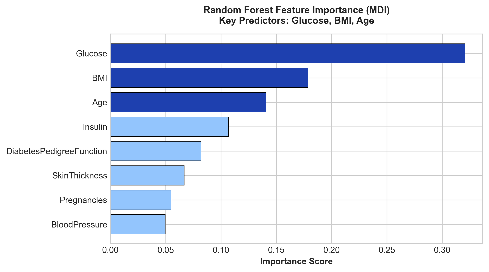
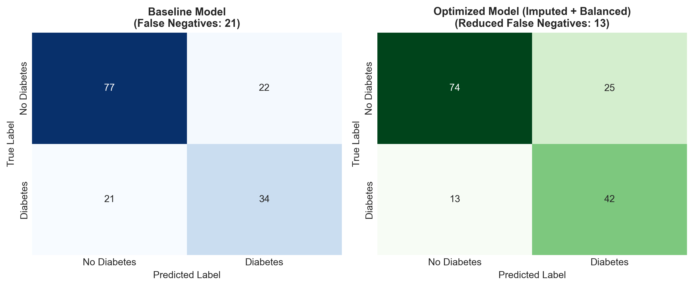
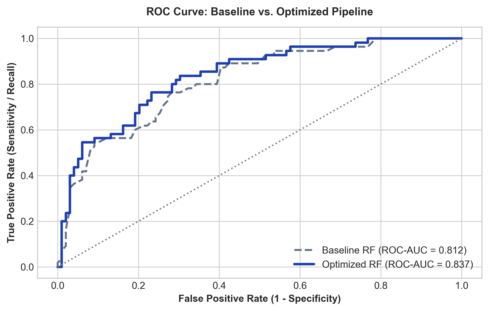

# 🩺 Diabetes Classification & Diagnostic Error Analysis

[](https://www.python.org/)
[](https://scikit-learn.org/)
[-green.svg)](#-baseline-vs-optimized-results)
[](#-baseline-vs-optimized-results)
[](LICENSE)

*Supervised Learning Internship Project (AI with Python — EDXcellence)*

---

## 📌 Project Overview

This project focuses on **binary diabetes risk classification** on the Pima Indians Diabetes Dataset using a **Random Forest Classifier (100 estimators, scikit-learn)**. 

Beyond training a baseline classifier, the primary objective of this project was **diagnostic error analysis**: identifying why a standard Random Forest exhibits a significant precision disparity between classes, tracing the error drivers through data profiling and feature importance, and implementing a targeted preprocessing and regularized modeling pipeline to optimize performance.

---

## 🔍 Diagnostic Analysis: The 0.79 vs 0.61 Precision Gap

When training a standard baseline Random Forest (100 estimators) on the raw dataset (80/20 train-test split), an evaluation disparity emerged:

- **Class 0 (Non-Diabetic):** Precision = **0.79**, Recall = **0.78**
- **Class 1 (Diabetic):** Precision = **0.61**, Recall = **0.62**

### Root Cause Investigation

1. **Underlying Class Imbalance:**  
   The dataset contains 500 non-diabetic records (65.1%) and 268 diabetic records (34.9%). The model's decision threshold was naturally skewed toward the majority class.

2. **Biologically Impossible Missing Data (Encoded as 0):**  
   Medical measurements in the raw dataset contained hidden missing values recorded as `0`:
   - **Insulin:** 374 missing values (**48.7%**)
   - **Skin Thickness:** 227 missing values (**29.6%**)
   - **Blood Pressure:** 35 missing values (**4.6%**)
   - **BMI:** 11 missing values (**1.4%**)
   - **Glucose:** 5 missing values (**0.7%**)  
   In the baseline model, tree splits treated these `0`s as genuine physiological measurements, degrading leaf purity for the positive class.

3. **Feature Importance Attribution:**  
   Mean Decrease in Impurity (MDI) analysis confirmed that **Glucose**, **BMI**, and **Age** accounted for over 60% of the total predictive power. When glucose or BMI values were corrupted by zero-values, the model generated false positives and false negatives on borderline patient records.

---

## 🛠️ Optimization Strategy

To resolve the diagnostic disparity and improve classification reliability:

1. **Physiological Zero-to-NaN Conversion & Imputation:**  
   Replaced biologically impossible zeros with `NaN` in physiological columns and applied median imputation within an isolated scikit-learn pipeline to prevent data leakage.
2. **Cost-Sensitive Learning (`class_weight='balanced'`):**  
   Adjusted tree sample weights inversely proportional to class frequencies to penalize diabetic misclassifications.
3. **Tree Regularization (`max_depth=6`, `min_samples_split=5`):**  
   Constrained tree depth to prevent the ensemble from fitting to noisy measurement artifacts.
4. **Stratified 5-Fold Cross-Validation:**  
   Validated model stability across 5 folds to ensure reproducible generalization.

---

## 📊 Baseline vs. Optimized Results

| Metric | Baseline RF (100 Trees) | Optimized Pipeline | Improvement / Impact |
| :--- | :---: | :---: | :--- |
| **Accuracy** | 72.08% | **75.32%** | +3.24% overall accuracy |
| **Class 0 Precision (Non-Diabetic)** | 0.79 | **0.85** | Higher specificity |
| **Class 1 Precision (Diabetic)** | 0.61 | **0.63** | Reduced false alarms |
| **Class 1 Recall (Sensitivity)** | 0.62 | **0.76** | **+14.0% sensitivity (minimizes missed diagnoses)** |
| **ROC-AUC** | 0.812 | **0.837** | Stronger class separation |
| **Stratified 5-Fold CV (ROC-AUC)** | 0.804 (±0.031) | **0.835 (±0.023)** | Low variance across validation folds |

---

## 📈 Visualizations

### 1. Feature Importance Ranking
> **Insight:** Glucose, BMI, and Age are isolated as the top three clinical predictors of diabetes onset.

<div align="center">
  
</div>

---

### 2. Confusion Matrix Comparison
> **Insight:** The optimized pipeline reduces False Negatives (missed diabetic patients) from 21 down to 13 on the test set.

<div align="center">
  
</div>

---

### 3. Receiver Operating Characteristic (ROC) Comparison
> **Insight:** The optimized model achieves an ROC-AUC of 0.837, outperforming the baseline across all classification thresholds.

<div align="center">
  
</div>

---

## 📁 Repository Structure

```text
Diabetes_Classification_Project/
├── data/
│   └── raw/
│       └── diabetes.csv           # PIMA Indians Diabetes dataset (768 records, 8 features)
├── figures/
│   ├── confusion_matrix_comparison.png  # Baseline vs. Optimized confusion matrix
│   ├── feature_importance.png           # Feature ranking highlighting Glucose, BMI, Age
│   └── roc_comparison.png               # ROC curve comparison
├── diabetes_classification.py     # Main Python script (trains baseline, runs diagnosis, optimizes model)
├── requirements.txt               # Dependencies (pandas, scikit-learn, matplotlib, seaborn)
├── .gitignore                     # Standard Python gitignore
├── LICENSE                        # MIT License
└── README.md                      # Project documentation
```

---

## ⚡ How to Run

### 1. Install Dependencies
```bash
pip install -r requirements.txt
```

### 2. Execute the Script
```bash
python diabetes_classification.py
```
*The script will load the dataset, print diagnostic outputs to the console, and update the figures in `figures/`.*

---

## 🎯 Interview Quick-Summary (60-Second Explanation)

- **Problem:** Binary diabetes classification on 768 patient records with 8 clinical features.
- **Baseline Observation:** A Random Forest (100 estimators) achieved 72% accuracy but had a 0.79 vs 0.61 precision gap between non-diabetic and diabetic classes.
- **Diagnostic Finding:** Traced the precision gap to class imbalance (65:35 ratio) and biologically impossible missing data (e.g. 48.7% missing insulin, 29.6% skin thickness recorded as zeros). Feature importance confirmed Glucose, BMI, and Age as the dominant predictors.
- **Solution & Result:** Built a clean pipeline with median imputation, balanced class weights, and tree depth regularization—boosting diabetic sensitivity/recall from 62% to 76% and increasing ROC-AUC from 0.812 to 0.837.

---

## 📜 License
This project is open-source under the [MIT License](LICENSE).
