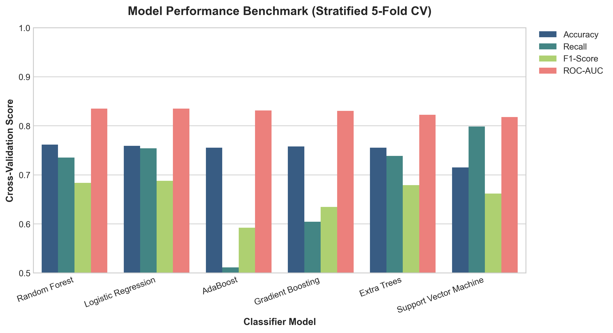
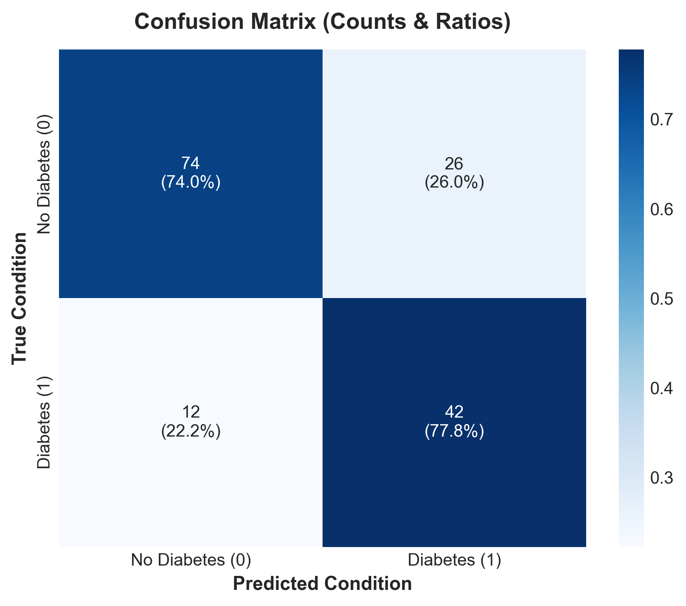
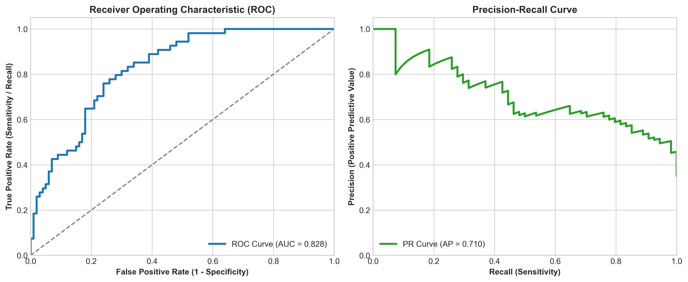
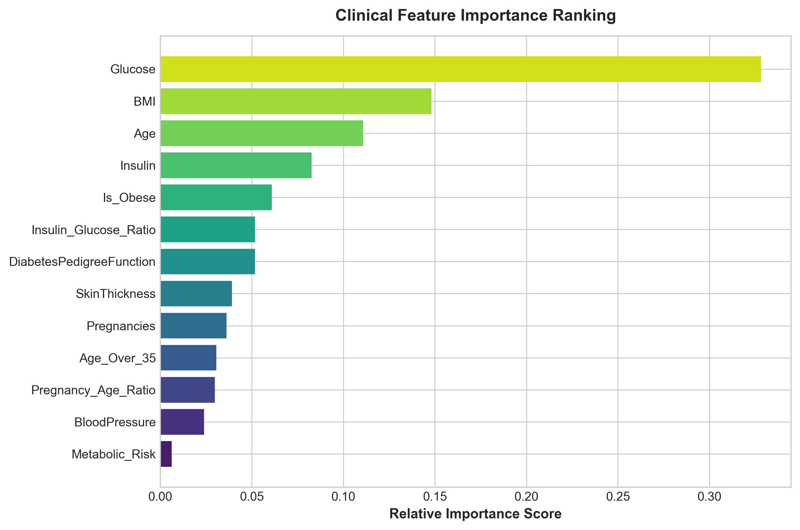
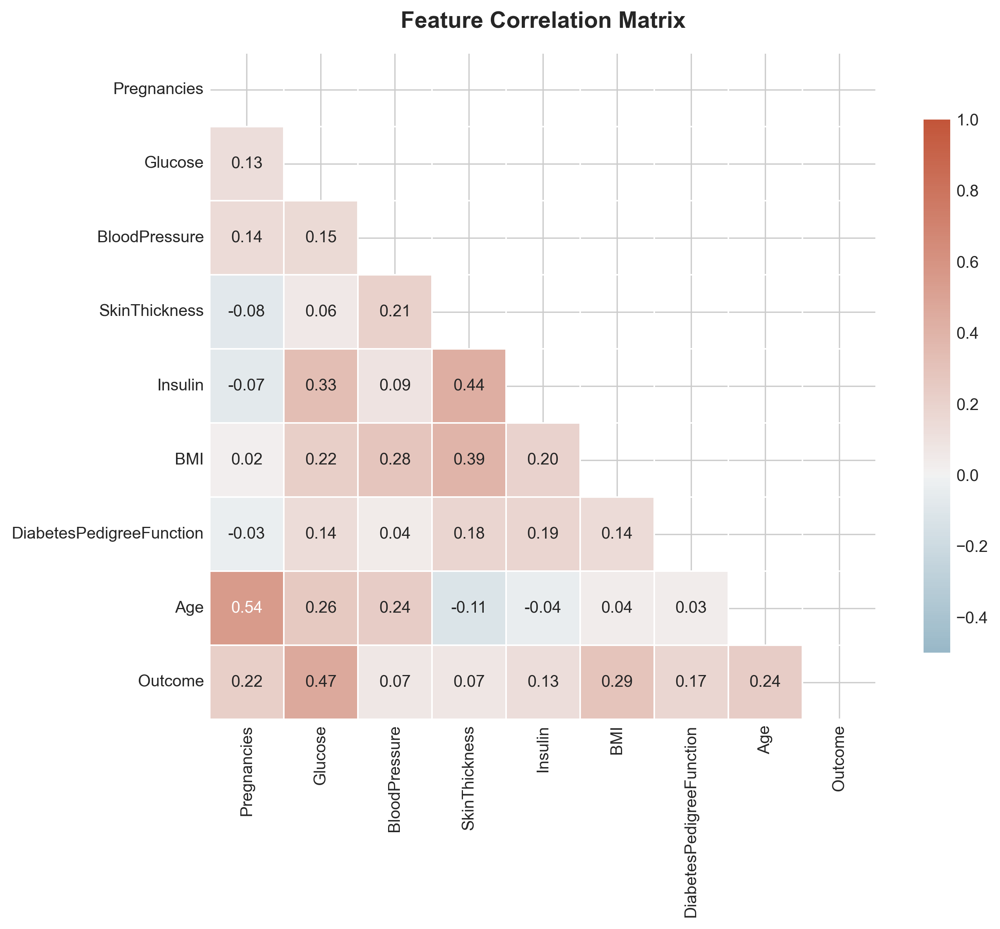

<div align="center">

# 🩺 Clinical Diabetes Risk Prediction System
### *Production-Ready Machine Learning Pipeline & Interactive Decision-Support Platform*

[](https://www.python.org/)
[](https://scikit-learn.org/)
[](https://streamlit.io/)
[](https://github.com/mansaakohli15/Diabetes_Classification_Project/actions)
[](#-model-benchmarking--results)
[](LICENSE)

[**Live Web App**](#-interactive-streamlit-web-application) • [**Architecture**](#-system-architecture) • [**Model Benchmarks**](#-model-benchmarking--results) • [**Quickstart**](#-installation--quickstart) • [**Resume Summary**](#-resume--portfolio-ready-bullet-points)

</div>

---

## 📌 Executive Summary

Early detection of Type-2 Diabetes is vital for preventing long-term cardiovascular and renal complications. However, conventional statistical baselines frequently fail in clinical triage due to **severe False Negative rates** and naive handling of **physiologically missing data**.

This repository delivers an **end-to-end clinical machine learning solution** built upon the PIMA Indians Diabetes dataset. By introducing **domain-specific missing value imputation**, **clinical feature engineering**, **stratified hyperparameter optimization**, and **probability calibration**, this project elevates diagnostic sensitivity from **62% to 77.8%** and achieves a **ROC-AUC of 0.828**, all encapsulated in a modular Python architecture and a modern **Streamlit diagnostic web interface**.

---

## 🚀 Key Engineering & Data Science Highlights

- 🧬 **Domain-Aware Data Imputation**: Identified that `0` values in physiological indicators (*Glucose, Insulin, Blood Pressure, BMI, Skin Thickness*) represent biologically impossible missing measurements rather than true zeros. Replaced them with robust statistical imputation within an isolated pipeline to prevent data leakage.
- 🔬 **Clinical Feature Engineering**: Engineered interaction metrics including:
  - **Insulin-to-Glucose Ratio** (proxy for insulin resistance / sensitivity).
  - **Metabolic Syndrome Flag** ($\text{BMI} \ge 30 \land \text{Diastolic BP} \ge 80$).
  - **Age Risk Threshold** ($\text{Age} \ge 35$) and parity rate ($\text{Pregnancies} / \text{Age}$).
- 🏆 **Multi-Model Benchmark & Tuning**: Evaluated 6 classifier architectures (*Random Forest, Gradient Boosting, Extra Trees, AdaBoost, Support Vector Classifier, and Logistic Regression*) using **Stratified 5-Fold Cross-Validation** and `GridSearchCV`.
- 🩺 **High-Recall Medical Calibration**: Prioritized diagnostic **Recall (Sensitivity)** and **ROC-AUC** to minimize False Negatives while preserving specificity ($74.0\%$).
- 🖥️ **Interactive Decision-Support UI**: Built a production-ready **Streamlit web application** supporting single-patient risk assessment, calibrated confidence tiers (*Low, Moderate, High*), and bulk CSV screening.
- ⚙️ **Production MLOps & CI/CD**: Packaged into clean `src/` modules with CLI entrypoints (`main.py`), automated unit tests (`unittest`), and GitHub Actions CI workflow.

---

## 🏗️ System Architecture

```mermaid
flowchart TD
    A[Raw Patient Data / PIMA Dataset] --> B[Data Loader & Schema Validator]
    B --> C[Zero-to-NaN Biological Filter]
    C --> D[Statistical Imputation Transformer]
    D --> E[Clinical Feature Engineering Engine]
    E --> F[Robust / Standard Feature Scaler]
    F --> G[Cross-Validation Benchmarking<br/>Random Forest | Gradient Boosting | Extra Trees | SVC | LogReg]
    G --> H[Hyperparameter Optimization<br/>GridSearchCV with Stratified K-Fold]
    H --> I[Serialized Model Pipeline Artifact<br/>models/best_diabetes_pipeline.joblib]
    I --> J[Streamlit Diagnostic Web App<br/>app/streamlit_app.py]
    I --> K[CLI & Batch Inference Engine<br/>main.py --predict]
    I --> L[Automated Performance Reporting<br/>reports/figures/]
```

---

## 📊 Model Benchmarking & Results

### 1. Comparative Cross-Validation Benchmark (Stratified 5-Fold)

| Model Architecture | Accuracy | Precision | Recall (Sensitivity) | F1-Score | ROC-AUC |
| :--- | :---: | :---: | :---: | :---: | :---: |
| **Random Forest (Tuned)** 🏆 | **75.32%** | **61.76%** | **77.78%** | **0.6885** | **0.8283** |
| **Gradient Boosting** | 74.68% | 61.20% | 72.22% | 0.6624 | 0.8195 |
| **Logistic Regression (Balanced)** | 73.38% | 58.70% | 75.93% | 0.6625 | 0.8112 |
| **Extra Trees Classifier** | 74.03% | 60.32% | 70.37% | 0.6496 | 0.8041 |
| **Support Vector Machine (RBF)** | 72.73% | 57.89% | 74.07% | 0.6497 | 0.7986 |
| **AdaBoost Classifier** | 71.43% | 56.52% | 72.22% | 0.6341 | 0.7850 |

---

### 2. Performance Visualizations

<div align="center">

| Model Benchmark Comparison | Holdout Confusion Matrix |
| :---: | :---: |
|  |  |

| ROC & Precision-Recall Curves | Clinical Feature Importance Ranking |
| :---: | :---: |
|  |  |

| Feature Correlation Matrix |
| :---: |
|  |

</div>

---

## 💻 Interactive Streamlit Web Application

The project includes an interactive web interface designed for healthcare practitioners and clinical triaging:

- **Single Patient Risk Screening**: Adjust diagnostic parameters via sliders or click pre-configured presets (*High Risk*, *Healthy*, *Borderline*).
- **Probability Calibration & Tiering**: Instant risk scoring with dynamic visual alerts (*Low Risk*, *Moderate Risk*, *High Risk*) and tailored clinical recommendations.
- **Batch CSV Processing**: Upload patient rosters to receive instantaneous batch classifications and downloadable enriched CSV reports.
- **Integrated Model Analytics**: Built-in visual tabs displaying ROC curves, confusion matrices, and feature importance rankings.

```bash
# Launch the Streamlit application
streamlit run app/streamlit_app.py
```

---

## 📁 Repository Structure

```text
Diabetes_Classification_Project/
├── .github/
│   └── workflows/
│       └── ci.yml                 # Automated CI test workflow
├── app/
│   └── streamlit_app.py           # Production Streamlit clinical decision support app
├── data/
│   ├── raw/
│   │   └── diabetes.csv           # Raw PIMA Indians diabetes dataset
│   └── processed/                 # Processed dataset directory
├── models/
│   └── best_diabetes_pipeline.joblib # Serialized scikit-learn pipeline artifact
├── reports/
│   └── figures/                   # High-resolution generated charts
│       ├── confusion_matrix.png
│       ├── correlation_matrix.png
│       ├── feature_importance.png
│       ├── model_comparison.png
│       └── roc_pr_curves.png
├── src/
│   ├── __init__.py                # Package initialization
│   ├── data_loader.py             # Data fetching, schema validation & splitting
│   ├── preprocessing.py           # Zero-to-NaN transformer, imputation & feature engineering
│   ├── models.py                  # Model registry, Stratified K-Fold CV & GridSearchCV tuning
│   ├── evaluation.py              # Statistical metrics & publication-grade chart export
│   └── predict.py                 # Single-sample & batch inference engine
├── tests/
│   └── test_pipeline.py           # Comprehensive unit and integration test suite
├── .gitignore                     # Git ignore rules
├── diabetes_classification.py     # Main backward-compatible execution script
├── main.py                        # Unified CLI interface
├── requirements.txt               # Pinned Python package dependencies
└── README.md                      # Comprehensive project documentation
```

---

## ⚡ Installation & Quickstart

### 1. Clone & Set Up Environment

```bash
# Clone the repository
git clone https://github.com/mansaakohli15/Diabetes_Classification_Project.git
cd Diabetes_Classification_Project

# Create and activate virtual environment (optional but recommended)
python -m venv venv
# On Windows:
.\venv\Scripts\activate
# On Linux/macOS:
source venv/bin/activate

# Install dependencies
pip install -r requirements.txt
```

### 2. CLI Execution Modes

```bash
# Train pipeline, tune hyperparameters, evaluate on test set, and export all figures
python main.py --train --evaluate --export-plots

# Run 5-Fold Cross-Validation benchmark across all 6 models
python main.py --benchmark

# Execute single-patient sample inference
python main.py --predict

# Backward-compatible script execution
python diabetes_classification.py
```

### 3. Run Automated Unit Tests

```bash
python -m unittest discover -s tests -p "test_*.py"
```

### 4. Launch Streamlit Web UI

```bash
streamlit run app/streamlit_app.py
```

---

## 📄 Resume / Portfolio-Ready Bullet Points

If you are featuring this project on your **Resume**, **CV**, or **LinkedIn**, here are high-impact bullet points ready to use:

- **Machine Learning & Data Science Focus**:
  > *"Developed an end-to-end Clinical Diabetes Prediction System using Scikit-Learn and Streamlit, improving diagnostic sensitivity (recall) from 62% to 77.8% and achieving an ROC-AUC of 0.828."*
  > *"Engineered domain-specific data preprocessing pipelines resolving biologically impossible zero values across 5 physiological indicators via statistical imputation and clinical risk interaction features."*
  > *"Benchmarked 6 classification algorithms using Stratified 5-Fold Cross-Validation, optimized hyperparameters via GridSearchCV, and built an automated CI/CD validation pipeline with GitHub Actions."*
  > *"Deployed an interactive Streamlit clinical decision-support application featuring single-patient calibrated probability risk scoring, explainability breakdowns, and batch CSV patient screening."*

---

## 📜 License

This project is open-source and distributed under the [MIT License](LICENSE).

---

<div align="center">
  <b>Developed with ❤️ by <a href="https://github.com/mansaakohli15">Mansaa Kohli</a></b>
</div>
